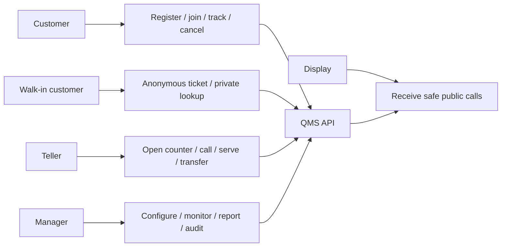
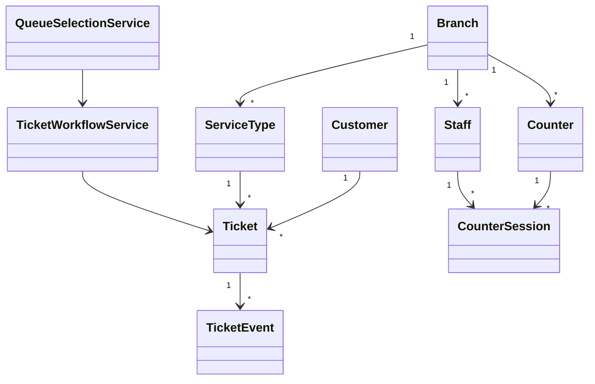
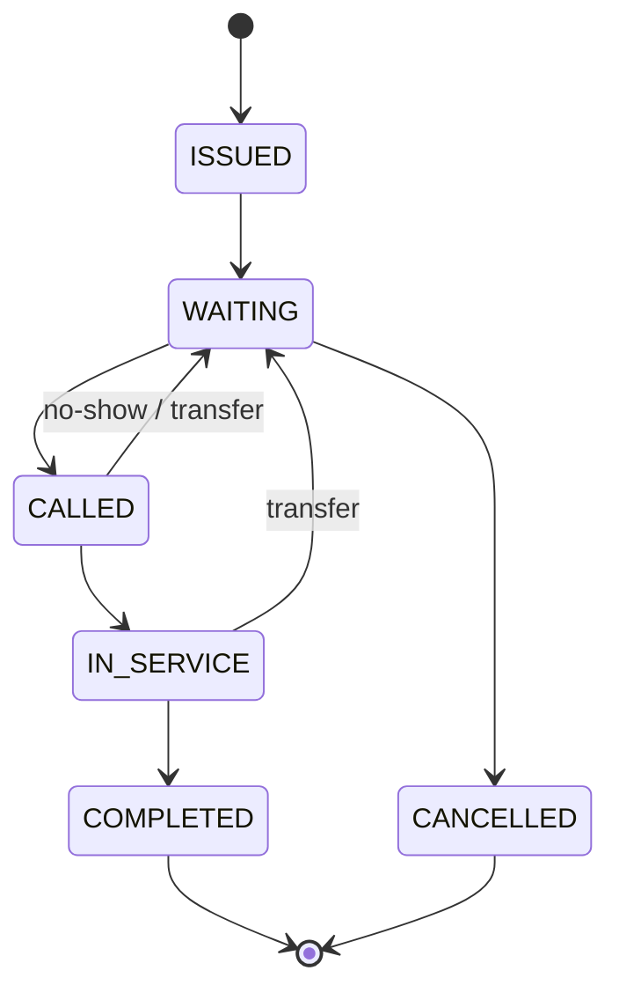
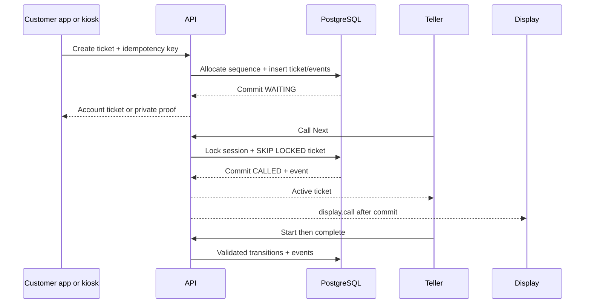
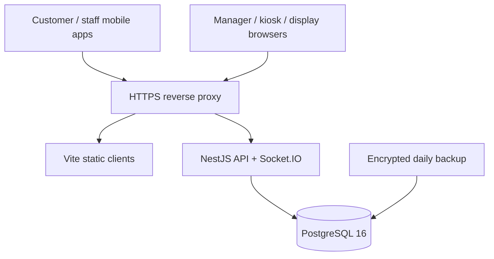

# Academic diagrams

## Use case

```mermaid
flowchart LR
  Customer --> Mobile[Register / join / track / cancel]
  WalkIn[Walk-in customer] --> Kiosk[Anonymous ticket / private lookup]
  Teller --> Serve[Open counter / call / serve / transfer]
  Manager --> Manage[Configure / monitor / report / audit]
  Display --> Calls[Receive safe public calls]
  Mobile --> API[QMS API]
  Kiosk --> API
  Serve --> API
  Manage --> API
  API --> Calls
```

## Domain class diagram

```mermaid
classDiagram
  Branch "1" --> "*" ServiceType
  Branch "1" --> "*" Counter
  Branch "1" --> "*" Staff
  Customer "1" --> "*" Ticket
  Counter "1" --> "*" CounterSession
  Staff "1" --> "*" CounterSession
  ServiceType "1" --> "*" Ticket
  Ticket "1" --> "*" TicketEvent
  TicketWorkflowService --> Ticket
  QueueSelectionService --> TicketWorkflowService
```

## Ticket statechart

```mermaid
stateDiagram-v2
  [*] --> ISSUED
  ISSUED --> WAITING
  WAITING --> CALLED
  WAITING --> CANCELLED
  CALLED --> IN_SERVICE
  CALLED --> WAITING: no-show / transfer
  IN_SERVICE --> WAITING: transfer
  IN_SERVICE --> COMPLETED
  COMPLETED --> [*]
  CANCELLED --> [*]
```

## Main ticket sequence

```mermaid
sequenceDiagram
  participant C as Customer app or kiosk
  participant A as API
  participant D as PostgreSQL
  participant T as Teller
  participant P as Display
  C->>A: Create ticket + idempotency key
  A->>D: Allocate sequence + insert ticket/events
  D-->>A: Commit WAITING
  A-->>C: Account ticket or private proof
  T->>A: Call Next
  A->>D: Lock session + SKIP LOCKED ticket
  D-->>A: Commit CALLED + event
  A-->>T: Active ticket
  A-->>P: display.call after commit
  T->>A: Start then complete
  A->>D: Validated transitions + events
```

## Deployment

```mermaid
flowchart TB
  Mobile[Customer / staff mobile apps] --> Proxy[HTTPS reverse proxy]
  Browsers[Manager / kiosk / display browsers] --> Proxy
  Proxy --> Web[Vite static clients]
  Proxy --> API[NestJS API + Socket.IO]
  API --> DB[(PostgreSQL 16)]
  Backup[Encrypted daily backup] --> DB
```
